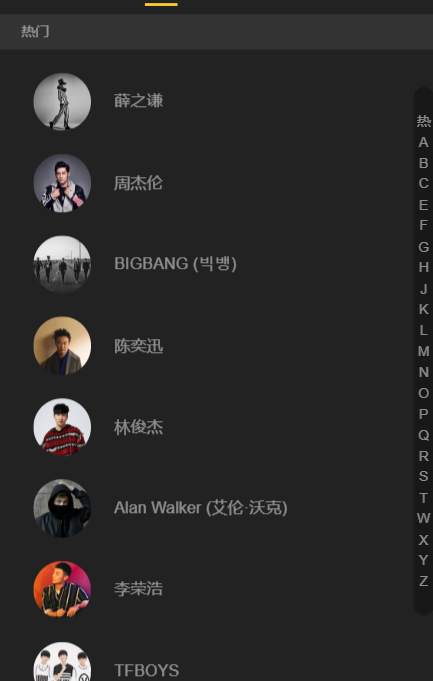

# 实现列表和索引表布局
## 列表
- dom结构：通常是scroll>ul>li>h2,ul>li>img,name
```html
 <ul>
      <li v-for="(group,index) in data"
          :key="index"
          class="list-group">
        <h2 class="title">{{group.title}}</h2>
        <ul>
          <li v-for="(item,index) in group.items"
              :key="index"
              class="list-group-item">
            
            <span class="name">{{item.name}}</span>
          </li>
        </ul>

      </li>
    </ul>

```
- css样式:listview相对定位,定义容器为当前屏幕,对应的list-group-item是一个flex布局 ,元素垂直居中对齐
```stylus
.listview
  position: relative
  width: 100%
  height: 100%
  overflow: hidden
  background: $color-background
  .list-group
    padding-bottom: 20px
    .title
      height: 30px
      line-height: 30px
      padding-left: 20px
      font-size: $font-size-small
      color: $color-text-l
      background: $color-highlight-background
    .list-group-item
      display: flex
      align-items: center
      padding: 20px 0 0 30px
      .avatar
        width: 50px
        height: 50px
        border-radius: 50%
      .name
        margin-left: 20px
        color: $color-text-l
        font-size: $font-size-medium
```
## 索引表
- 首先索引表里面的数据是需要截取group.title的第一个字符串 所以这里会对数组进行处理
```js
// 计算属性中定义
 shortcutlist () {
      return this.data.map((group) => {
        // *map方法 得到一个经过处理后的数组 热门区 字母索引区 substr拿第一个字符
        return group.title.substr(0, 1)
      })
    }
```
:::tip
Array.map(callback)方法是返回一个处理过后的数组,
substr(a):取对应下标之后的元素
substr(a,b):取下标为a-b的元素
substring(a):截取对应下标元素
substring(a,b):截取a-b下标的元素
:::
- dom结构

```html
<div class="list-shortcut">
      <ul>
        <li v-for="(item,index) of shortcutlist"
            :key="index"
            class="item"
            :data-index="index"
            @touchStart.stop.prevent="OnshortcutTouchstart"
            @touchStop.stop.prevent="OnshortcutTouchstop">{{item}}</li>
      </ul>

    </div>
```
- 对应样式:1.垂直居中 2.绝对定位靠右  3.对应容器样式
```stylus
  .list-shortcut
    position: absolute
    z-index: 30
    right: 0
    top: 50%
    padding: 20px 0
    text-align: center
    border-radius: 10px
    transform: translateY(-50%)
    background: $color-background-d
    font-family: Helvetica
    .item
      padding: 3px
      line-height: 1
      color: $color-text-l
      font-size: $font-size-small
```
:::tip
通常是使一个容器垂直方向居中的做法是：
posiition:absolute
top:50%
margin-top:-height
但是这是在知道容器高度的前提下，我们在不知道元素高度的前提下使用transform平移的方法来进行处理
posiition:absolute
top:50%
transform:translateY(-50%)
:::

## 效果图



