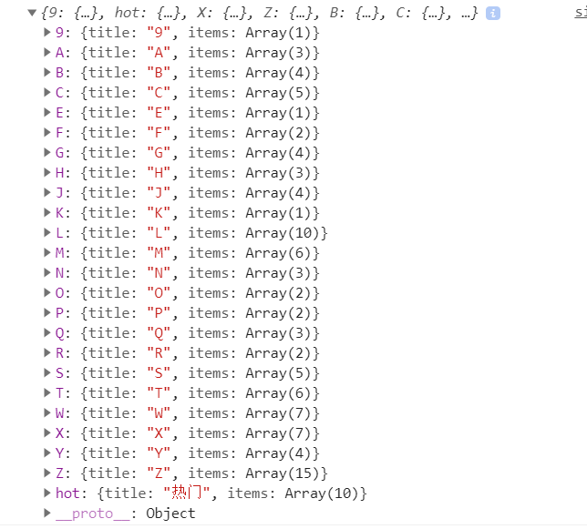
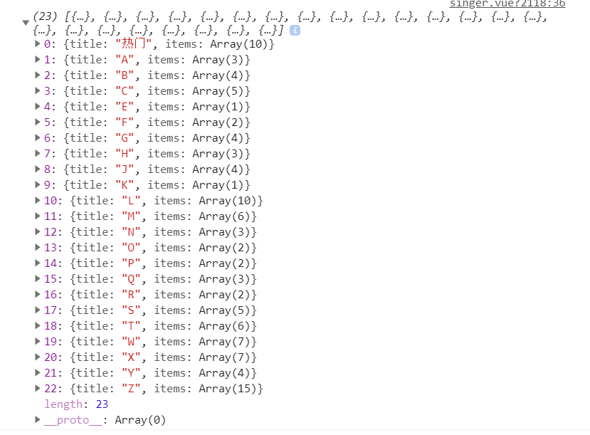

# 开发Singer组件
## 封装获取到的singer-list数据
:::tip
你通过jsonp拿到的singer数据并不是符合vue调用的jsonp格式
你必须要封装字母表类排序的对象数组
:::
### 你拿到的jsonp数据

### 你要做的事情
- 定义一个map对象:里面包含了**热门歌手list对象**(**title,items[]**),还有**歌手list对象**(**title,items**)
```js
let map={
  hot:{
    title:'热门，
    items:[]
  }
}
```
- 创建Singer类,后面需要往items数组中push该对象
```js
export default class Singer{
constructor({id,name}){
  this.id=id
  this.name=name
  this.avtar=`ttps://y.gtimg.cn/music/photo_new/T001R300x300M000${id}.jpg?max_age=2592000`
}
}

```

- 循环遍历,封装数据

```js
  list.forEach((item,index)=>{
    // 热门歌手区
    if(index<10){
      map.hot.items.push(new Singer({
        id:item.Fsinger_mid
        name:item.Fsinger_name
      }))
    }
    // 歌手区
    const key=item.Findex
    if(!map[key]){
      map[key]={
        title:key,
        items:[]
      }
    }
    map[key].items.push(new Singer({
      id:item.Fsinger_mid
      name:item.Fsinger_name
    }))

  })

```
**这样数据就会变成如下形式**
以字母顺序排列的map对象


## 对数据进行排序
:::warning 
我们只是用map对象盛满了hot对象和map[key]对象,然而vue遍历对象会是一个无序的结果,所以我们还是要将
对象经过过排序装入数组,得到一个满意的对象数组
:::
```js
let hot=[]
let singers=[]
for(let key in map){
  let value=map[key]
  if(value.title.match(/[a-zA-Z]/)){
    // 如果匹配的是字母
    singers.push(value)
  }else if(value.title === '热门'){
    hot.push(value)
  }
}
....
return hot.concat(singers)

```

**Get到预期的效果**:

