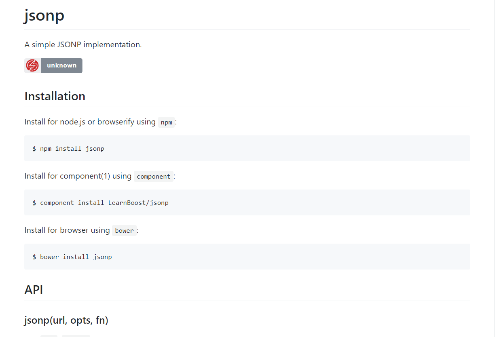

# 使用jsonp
## 什么是jsonp
> 为了便于客户端使用数据，逐渐形成了一种非正式传输协议，人们把它称作JSONP，该协议的一个要点就是允许用户传递一个callback参数给服务端，然后服务端返回数据时会将这个callback参数作为函数名来包裹住JSON数据，这样客户端就可以随意定制自己的函数来自动处理返回数据了。

## jsonp跨域原理
**跨域的原理**
1. 使用**script 标签**发送请求，这个标签支持跨域访问
2. 在script 标签里面给服务器端传递一个 callback
3.** callback **的值对应到页面一定要定义一个全局函数（为什么是全局？因为服务端接收到callback函数后会返回页面中的script中去找，如果不写在全局作用域中根本找不到）
4. 服务端返回的是一个函数的调用。调用的时候会吧数据作为参数包在这个函数里面。
::: warning
jsonp只支持get式请求
:::

## jsonp的具体参数

- **url (String) url to fetch**
- **opts (Object)， optional**
 1. _**param**_(String) name of the query string parameter to specify the callback (defaults to callback)
2. **_timeout_** (Number) how long after a timeout error is emitted. 0 to disable (defaults to 60000)
3. _**prefix**_ (String) prefix for the global callback functions that handle jsonp responses (defaults to __jp)
4. _**name**_ (String) name of the global callback functions that handle jsonp responses (defaults to prefix + incremented counter)
- **callback**
