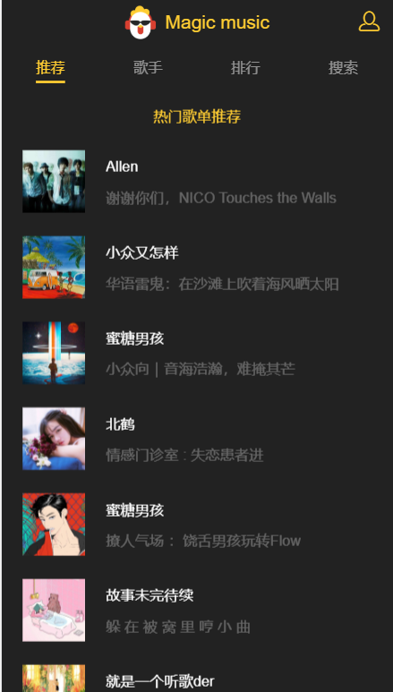

## 推荐歌单页面
### 基本结构开发 数据获取
dom结构
```html
 <div class="recommend-list"
             ref="recommendscroll">
          <h1 class="list-title">热门歌单推荐</h1>
          <ul>
            <li v-for="(item,index) in recommendsList"
                :key="index"
                class="item">
              <div class="icon">
                
              </div>
              <div class="text">
                <h2 class="name"
                    v-html="item.creator.name"></h2>
                <p class="desc"
                   v-html="item.dissname"></p>
              </div>
            </li>
          </ul>
        </div>
```
:::warning
这个recommendList获取的数据不是用jsonp抓取的,而是修改devserve代理,利用axios发送ajax数据获取
:::
代码如下:
首先修改webpac-dev-config.js
```js
// !模拟数据需要引入的依赖
var express = require('express')
var axios = require('axios')
var app = express()
var apiRoutes = express.Router()
app.use('/api', apiRoutes)

  before(app) {
            app.get('api/getRecommendlist', (req, res) => {
                var url = 'https://c.y.qq.com/splcloud/fcgi-bin/fcg_get_diss_by_tag.fcg'
                axios.get(url, {
                    headers: {
                        referer: 'https://c.y.qq.com/',
                        host: 'c.y.qq.com'
                    },
                    params: req.query()

                }).then((response) => {
                  // response是获取到的qq音乐
                  的response
                    res.json(response.data)
                }).catch((e) => {
                    console.log(e)
                })
            })
        }
```
返回回调获取数据
```js
export function getRecommendlist () {
  const url = '/api/getRecommendlist'
  const data = Object.assign({}, commonParams, {
    platform: 'yqq',
    hostUin: 0,
    sin: 0,
    ein: 29,
    sortId: 5,
    needNewCode: 0,
    categoryId: 10000000,
    rnd: Math.random(),
    format: 'json'
  })
  return axios.get(url, {
    params: data
  }).then((res) => {
    return Promise.resolve(res.data)
  })
}
```
**css样式**:运用flex布局
```css
 .recommend-list
      .list-title
        height: 65px
        line-height: 65px
        text-align: center
        font-size: $font-size-medium
        color: $color-theme
      .item
        display: flex
        box-sizing: border-box
        align-items: center
        padding: 0 20px 20px 20px
        .icon
          flex: 0 0 60px
          width: 60px
          padding-right: 20px
        .text
          display: flex
          flex-direction: column
          justify-content: center
          flex: 1
          line-height: 20px
          overflow: hidden
          font-size: $font-size-medium
          .name
            margin-bottom: 10px
            color: $color-text
          .desc
            color: $color-text-d
```
### scroll组件开发
:::tip
由于better-scroll组件运用起来太命令化,所以自己动手造轮子 开发scroll组件
:::
#### 1.定义scroll的属性
```js
 props: {
    probeType: {
      // 监听滚动事件类型
      type: Number,
      default: 1
    },
    click: {
      type: Boolean,
      default: true
    },
    data: {
      type: Array,
      default: null
    }
  },
```
#### 2.初始化scroll并代理内置better-scroll方法
```js
 methods: {
    _initscroll () {
      if (!this.$refs.wrapper) {
        return
      }
      this.scroll = new BSroll(this.$refs.wrapper, {
        probeType: this.probeType,
        click: this.click
      })
    },
    enable () {
      // 启用better-scroll
      this.scroll && this.scroll.enable()
    },
    disable () {
      // 启用better-scroll
      this.scroll && this.scroll.disable()
    },
    refresh () {
      this.scroll && this.scroll.refresh()
    }

  },
```
:::danger
scroll的点击事件会和fastClick的点击冲突,解决办法是在dom的父容器上加一个needsclick的class
:::
#### 监听到传过来的数据就重新计算高度
```js
watch: {
    data () {
      // 监听到data变化 重新refresh计算高度
      setTimeout(() => {
        this.refresh()
      }, 20)
    }
  }

```

### 数据懒加载
使用vue-lazyload插件
```js
// 传入默认图片参数
Vue.use(VueLazyload, {
  loading: require('./common/image/default.png')
})
然后直接在img标签上将:src替换为v-lazy就OK了

```
:::warning
解决bug:等待数据渲染dom之后才能重新计算高度 且要等到完全加载再进行计算
:::
示例代码
给image添加load事件
```js
    loadimage () {
      if (!this.checkLoaded) {
        // !图片加载完 重新计算 第一张图片加载就计算高度 后面不需要重新计算
        this.$refs.scroll.refresh()
        this.checkLoaded = true
      }
    }

```
## 实现效果


