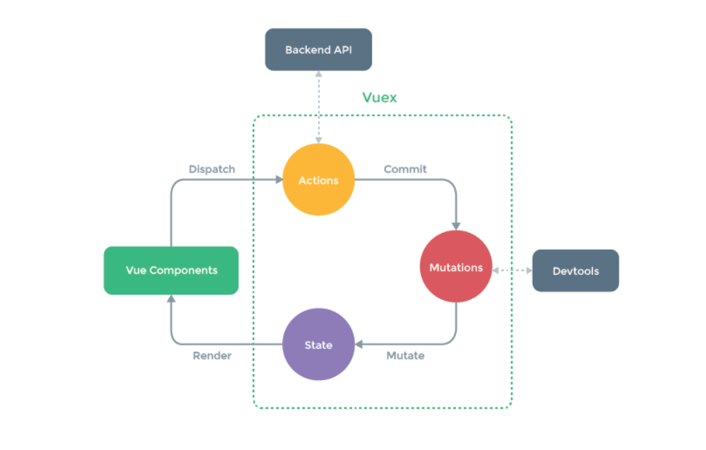

## 了解vuex
`Vuex` 是一个专为 Vue.js 应用程序开发的状态管理模式。它采用集中式存储管理应用的所有组件的状态，并以相应的规则保证状态以一种可预测的方式发生变化。Vuex 也集成到 Vue 的官方调试工具 `devtools` extension，提供了诸如零配置的 time-travel 调试、状态快照导入导出等高级调试功能。

> 简单来说就是一个`公共仓库` 你可以通过组件来修改仓库内容 共享仓库内容 并render回组件

**要掌握vuex,你只要把这张图搞清楚了就可以**

:::tip 简单解读

* 首先vuex创建一个`store`区域，存储公共`state`数据,`actions`:改变数据的传入的批量同步方法或者异步操作，'mutations':修改state数据调用
* 组件修改state里面的数据,必须要通过`dispatch`传递操作调用actions,然后再通过`commit`递交方法给mutations，mutations里面修改`state`数据即可
* 当然你可以跳过actions 直接通过注册方法修改state
:::
## 使用方法
一个简单的实例
```js
store下面的index.js
import Vue from 'vue'
import Vuex from 'vuex'
Vue.use(Vuex)
//大型应用分开写  actions mutations mutations-type getters index state
export default new Vuex.Store({
state:{
    city:"上海"
},
actions:{
    //外部组件传过来的actions
    changeCity(ctx,city){
        ctx.commit('increment','city')
        //通常increment被封装在mutations-type中 然后通过import * as a取出
    }
},
mutations:{
    increment(state,city){
        state.city=city
    }
}

})

```
## 通过vuex获取到singer对象
* 首先在store目录下创建以下目录
```md
├── store
│   ├── index.js(vuex入口文件)
│   ├── actions.js(异步操作文件)
│   ├── mutations.js(修改state数据文件)
│   ├── mutations-types.js(mutations关联文件)
│   ├── getters.js(获取state数据文件)
│   ├── state.js
```
<h3>初始化文件</h3>
<br>
state.js

```js
const state ={
  singer:{}
}
export default state
```
getters.js

```js
export const singer=state=>state.singer;

```
mutations-types.js

```js
export const SET_SINGER='SET_SINGER'
```
mutations.js

```js
import * as types from 'mutations-types'
//* as 通过这样的import就可以避免花括号一个一个引入
export default mutations={
  // 常数作为函数名
  [types.SET_SINGER](state,singer){
    state.singer=singer
  }
}
```
**index.js**
```js
import Vue from 'vue'
import Vuex from 'vuex'
import state from 'state'
import mutations from 'mutations'
import * as getters from 'getters'
import * as actions from 'actions'
import createLogger from 'vuex/dist/logger'
Vue.use(Vuex)
// 生产环境开启 线上不开启
const debug = process.env.NODE_ENV !== "production";

export default new Vuex.Store({
  actions,
  getters,
  state,
  mutations,
  // 严格模式
  strict: debug,
  // 打印vuex修改state日志
  plugins: debug ? [createLogger()] : []
});

```
* 接下来使用vuex来获取singer对象
::: warning
vuex提供了mapxxx语法堂对每个环节的操作代码进行简化 
:::
  * main.js引入vuex 引入并注册store即可
  * singer.vue操作
```js
import {mapMutations} from 'vuex'
methods:{
  ...mapMutations({
    setSinger:'SET_SINGER'
  })
}

```
这里的的操作是`映射`，将 this.setSinger映射为 this.$store.commit(SET_SINGER) 简化了代码
然后你直接可以使用setSinger来操作state数据
```js
selectSinger(singer){
  this.$router.push({
    path:`singer/${singer.id}`
  });
  this.setSinger(singer)
}
```
这样就完成了设置store里面数据的操作,接下来就是拿数据
  * singer-detail.vue

```js
import {mapGetters} from 'vuex'
computed:{
...mapGetters(
  // 之前getters.js里面已经处理过数据,所以不需要添加操作 直接引用既可
  ['singer']
)
}

```

<br>

## 总结
综上完成`vuex`的基本使用,总结出以下步骤
:::tip
1. 定义好初始化文件 `store`相关
2. 使用vuex可以通过语法堂`mapxxx`进行映射操作
3. 数据会自动发生映射 不需要操作
:::
详细了解vuex,请参考[vuex官网](https://vuex.vuejs.org/zh/)
next :封装数据
