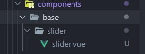

# Recommend页面
该页面由轮播 推荐歌单页面 歌单详情页面组成
## 轮播
- 使用vue-awesome-swiper第三方插件构成轮播图
轮播模板
相关插件地址 [vue-awesome-swiper](https://github.com/surmon-china/vue-awesome-swiper)
```js
<template>
  <div class="recommend">
    <div class="recommend-content">
      <div class="slide-wrapper">
        <swiper :options="swiperOption"
                ref="mySwiper">
          <!-- slides -->
          <swiper-slide v-for="(item,index) of recommends"
                        :key="index">
            <a :href="item.linkUrl">
              
            </a>
          </swiper-slide>
          <!-- Optional controls -->
          <div class="swiper-pagination"
               slot="pagination"></div>
        </swiper>
      </div>
      <div class="recommend-list">
        <h1 class="list-title">热门歌单推荐</h1>
        <ul></ul>
      </div>
    </div>
  </div>
</template>
.....
data () {
    return {
      recommends: [],
      swiperOption: {
        // 使用轮播控制dots 轮回轮播 三秒自动跳转
        pagination: '.swiper-pagination',
        loop: true,
        autoplay: 3000,
        autoplayDisableOnInteraction: false
      }

    }
```
::: warning
再使用组件前  最好全局注册
:::
## 效果图

<br>

## 自定义轮播组件(slider)
**文件目录**
<br/>



>书写自定义组件前安装好better-scroll插件 项目依赖
### 第一步.写好基本dom结构和样式
```html
<template>
  <div class="slider"
       ref="slider">
    <div class="slider-group"
         ref="sliderGroup">
      <slot></slot>
    </div>
    <div class="dots">
      <span v-for="(item,index) of dots"
            :key="index"
            :class="{active:currentpageindex===index}"
            class="dots-item">
      </span>
    </div>
  </div>
</template>
```
```stylus
<style lang='stylus' scoped>
@import '~@/common/stylus/variable.styl'
.slider
  min-height: 1px
  .slider-group
    position: relative
    overflow: hidden
    white-space: nowrap
    .slide-item
      // * 轮播图slidergroup的样式
      float: left
      box-sizing: border-box
      overflow: hidden
      text-align: center
      a
        display: block
        width: 100%
        overflow: hidden
        text-decoration: none
      img
        display: block
        width: 100%
  .dots
    position: absolute
    top: 130.075px
    right: 0
    left: 0
    bottom: 12px
    text-align: center
    font-size: 0
    height: 8px
    .dots-item
      display: inline-block
      margin: 0 4px
      width: 8px
      height: 8px
      border-radius: 50%
      background: $color-text-l
      &.active
        width: 20px
        border-radius: 5px
        background: $color-text-ll
</style>

```
### 第二步.定义好slider组件的属性
```js
 props: {
    loop: {
      // *循环轮播
      type: Boolean,
      default: true
    },
    autoPlay: {
      // *自动轮播
      type: Boolean,
      default: true
    },
    interval: {
      // *轮播间隔
      type: Number,
      default: 3000
    }

```
### 第三步.计算出slider的宽度 然后再根据此设置sliderGroup的宽度
```js
 _setSliderwidth (isResize) {
      this.children = this.$refs.sliderGroup.children
      // better-scroll 会多复制两份
      let width = 0
      // 拿到slide宽度
      let sliderwidth = this.$refs.slider.clientWidth
      // 计算slidegroup的宽度
      for (let i = 0; i < this.children.length; i++) {
        let child = this.children[i]
        // 添加dom样式
        addClass(child, 'slide-item')
        // child的宽度
        child.style.width = sliderwidth + 'px'
        // 总宽度
        width += sliderwidth
      }
      if (this.loop && !isResize) {
        // 循环切换 width加两倍sliderwidth
        width += 2 * sliderwidth
      }
      // 设置slider-group宽度
      this.$refs.sliderGroup.style.width = width + 'px'
    }
```
:::tip
其中为每个slider的children添加样式时采用的是调用模块
,通过正则表达式判断是否有该class,然后再将class添加到dom上。
:::
模块代码dom.js为
```js
export function hasClass (el, className) {
  // todo:/(^|\\s)+(className)+(\\s|$)/
  let reg = new RegExp('(^|\\s)' + className + '(\\s|$)')
  // 判断是否有class
  return reg.test(el.className)
}

export function addClass (el, className) {
  if (hasClass(el, className)) {
    return
  }
  // 空白间隔开
  let newClass = el.className.split(' ')
  newClass.push(className)
  // 连接成新class
  el.className = newClass.join(' ')
}

```
### 第四步.初始化slider

```js
 _initSlider () {
      this.slider = new BScroll(this.$refs.slider, {
        scrollX: true,
        scrollY: false,
        // !惯性 循环 轮播间隔 可以点击
        momentum: false,
        snap: true,
        snapLoop: this.loop,
        snapThreshold: 0.3,
        snapSpeed: 300
      })
```
### 第五步.添加下方的dots控制器

```js
 data () {
    return {
      dots: [],
      currentpageindex: 0

    }
  },

  _initdots () {
      this.dots = new Array(this.children.length)
    }
```
### 第六步.计算出轮播下标 实现dots的样式
**监听slider的scrollEnd事件 然后获取下标**
```js
 // 获取当前下标 滚动派发scrollEnd事件 
      this.slider.on('scrollEnd', () => {
        // pageX 当前pageindex
        let pageIndex = this.slider.getCurrentPage().pageX
        if (this.loop) {
          // 默认第一个元素会添加拷贝 所以要减掉一
          pageIndex -= 1
        }
        this.currentpageindex = pageIndex
        if (this.autoPlay) {
          //! 轮播前必须清除 不然跳到第二章图片会stop 然后因为settimeout只执行一次 所以再执行一遍_play()
          clearTimeout(this.timer)
          this._play()
        }
      })
    },
```
**获取到下标后 给dom设置active样式**

```html
 <div class="dots">
      <span v-for="(item,index) of dots"
            :key="index"
            :class="{active:currentpageindex===index}"
            class="dots-item">
      </span>
    </div>
```
### 第七步.添加自动轮播
**利用better-scroll的goToPage接口实现**
```js
_play () {
      let pageIndex = this.currentpageindex + 1
      if (this.loop) {
        pageIndex += 1
      }
      this.timer = setTimeout(() => {
        // x下标 y下标 每个轮播切换动画300ms 设置时间间隔
        this.slider.goToPage(pageIndex, 0, 300)
      }, this.interval)
    }
```
:::warning
注意:此时的轮播图轮播到第二张图还是不会继续自动轮播,这是因为slier的autoplay是设置了setTimeout函数 所以必须在初始化时清除掉timer,然后再重新计算一遍,还需要监听到窗口变化然后重新计算宽度,传一个参数控制是否重新计算
:::
```js
  if (this.autoPlay) {
          //! 轮播前必须清除 不然跳到第二章图片会stop 然后因为settimeout只执行一次 所以再执行一遍_play()
          clearTimeout(this.timer)
          this._play()
        }

....
 mounted () {
    setTimeout(() => {
      this._setSliderwidth()
      this._initdots()
      this._initSlider()
      if (this.autoPlay) {
        this._play()
      }
    }, 20)
    // 监听到窗口发生改变就重新计算宽度
    window.addEventListener('resize', () => {
      if (!this.slider) {

      }
      this._setSliderwidth(true)
      this.slider.refresh()
    })
  },
```
:::danger
请求recommends是一个异步请求,它加载出资源有延时,所以再slot渲染到父组件前可能recommeds是一个空数组,会导致样式添加失效
:::
**解决方法**:在slider组件的父dom上绑定v-if控制
```html
   <div v-if="recommends.length"
           class="slider-wrapper">
        <slider>
          <div v-for="(item,index) in recommends"
               :key="index">
            <a :href="item.linkUrl">
              
            </a>
          </div>
        </slider>
      </div>
```
**综上,slide组件算是完成了,自己写插件组件还是挺爽的,很有利于造轮子的能力提升**
