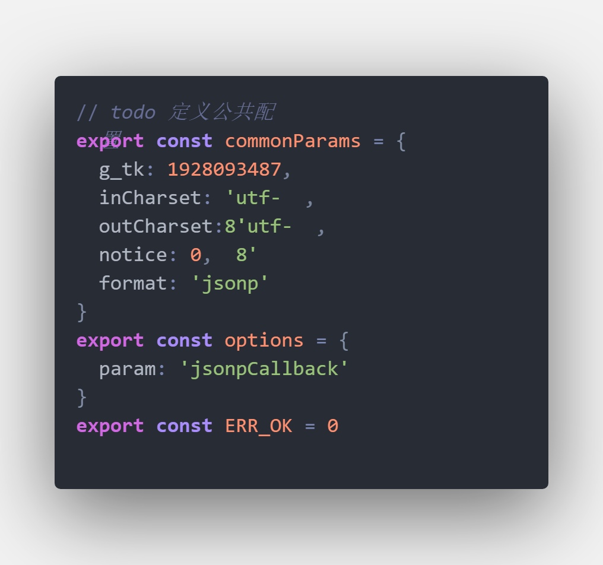

# Using jsonp
## Package jsonp
Use ES6 to return**promise**Object gets content in a callback
<br>

**Splicing URL**

## Set public configuration
Setting public configuration defines public parameters, options and a constant

## Call JSON function
Get to**url** **data** **callback** Three parameters 
Then grab the data

## recommendComponent usage
::: tip
Define array objects before using API to facilitate ref operation
:::
```js
  created () {
    this._getcommend()
  },

  methods: {
    _getcommend () {
      getRecommend().then((res) => {
        if (res.code === ERR_OK) {
          console.log(res.data.slider)
          this.recommends = res.data.slider
        }
      })
    }
  },
```
